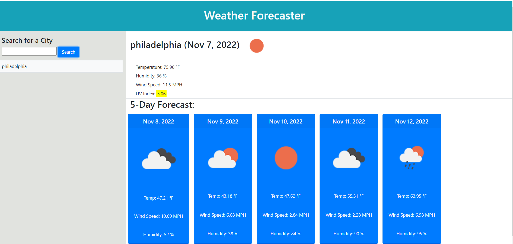

# Weather Forecaster

## Table of Contents

- [Project Description](#Description)

* [Usage](#Usage)
* [License](#License)
* [Questions](#Questions)

## Description

The Weather Forecaster is a dashboard that utilizes the OpenWeather One Call API. Users are able to enter the
name of a city into a form and retrieve the daily weather along with a 5-day forecast. The forecast includes weather
conditions such as the temperature, the humidity, the wind speed and the UV index.

## Usage

Checkout the Weather Forecast!

## License

GPL 3.0

This project is licensed by the GPL 3.0.

## Tests

Use the following command to run tests:

` n/a `

## Questions

Contact me with additional questions at

Orsha Goines at orshamarie@email.com or check out my work on GitHub at

[GitHub](https://github.com/[ogoines]
